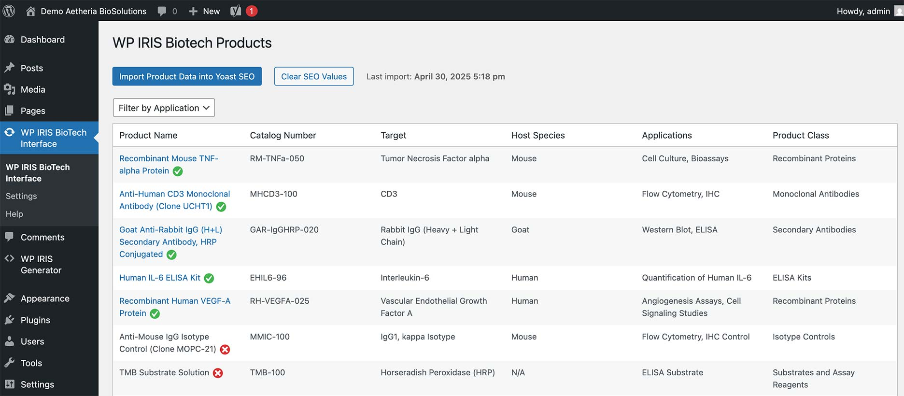

# WordPress IRIS Interface Application

This repository sets up a training Docker instance that runs the latest version of IRIS for Health off the Community docker image. 

## Contributors

* [Shawntelle Madison-Coker](https://community.intersystems.com/user/shawntelle-madison-coker) 

## Goal
This project helps developers **connect IRIS data to WordPress**, whether you're building SEO tools, dynamic content, or custom APIs. This tool is designed for scalability and includes:  
- A **generic IRIS framework** for REST endpoints (no router modifications needed).  
- **Two WordPress plugins** to consume demo IRIS data and generate IRIS sample code.

The biotech SEO demo (included) shows how to auto-generate metadata, but the framework works for e-commerce, publishing, internal tools, and more.

## **WordPress Tools**  
1. **WP Iris Code Generator**  
   - UI for WordPress devs to design IRIS REST endpoints.  
   - Exports clean ObjectScript code (hand off to IRIS admins).  

2. **Demo: Biotech SEO Plugin**  
   - Example integration: Auto-generate Yoast SEO data from IRIS data. 

# Getting Started

## Installation with Docker 

## Prerequisites
Make sure you have [git](https://git-scm.com/book/en/v2/Getting-Started-Installing-Git) and [Docker desktop](https://www.docker.com/products/docker-desktop) installed.

Clone/git pull the repo into any local directory e.g. like it is shown below:

```bash
$ git clone git@github.com:sncoker/wp-iris-project.git/
```

Open the terminal in this directory and run:

```bash
$ docker-compose up -d --build
```

## Management portal: 

The management portal is available at: 
[Management portal](http://localhost:62773/csp/sys/UtilHome.csp)

```bash
Login: _system/SYS
```

## Sample WordPress Biotech Demo Website Project



To access biotech demo WordPress: [WordPress Demo URL](http://localhost:8000/)

[WordPress Demo Website and Plugins Documentation](wordpress-site.md)

## WP Iris Framework Documentation

The WP Iris Framework been provided in: `src\WordPressAPI\Framework\`.

[WP Iris Framework Documentation](wp-iris-framework.md)

## REST APIs - TESTING

**Documentation**
[API Testing Documentation](wp-iris-framework-postman.md)

**Postman Collection**
There is a Postman Collection located in the `testing` folder:

`testing\wp_iris_framework.postman_collection.json` 

## Built with
Using VSCode and ObjectScript plugin, IRIS for Health Community Edition in Docker, IRIS openapi API, WordPress, PHP, and Javascript.

## Collaboration 
Any collaboration is very welcome! Fork and send Pull requests!