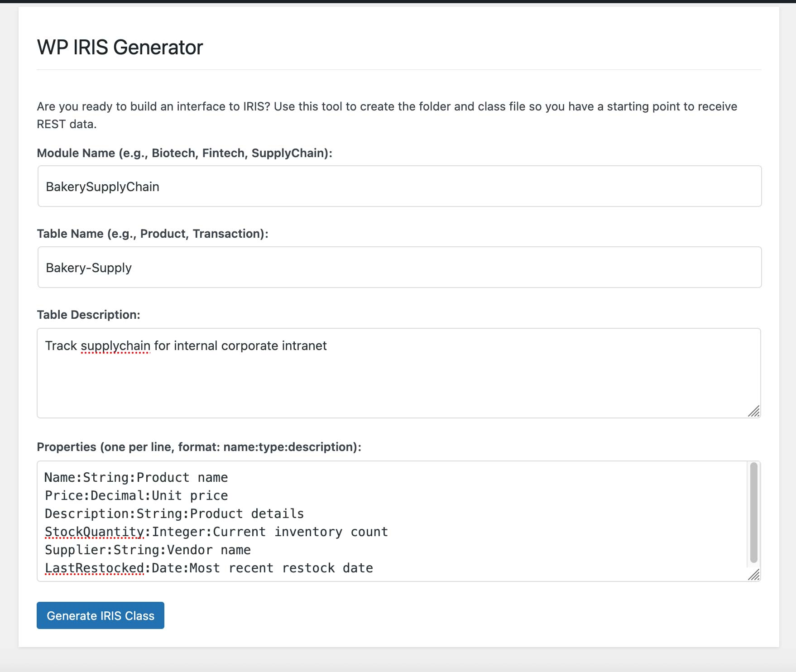

# WordPress Site Documentation

## Accessing the WordPress Site

1. Open your web browser and navigate to:
   ```
   http://localhost:8000
   ```

2. You will be redirected to the WordPress login page. Use the following credentials:
   - Username: `admin`
   - Password: `admin`

## WordPress Dashboard

After logging in, you'll be taken to the WordPress Dashboard. Here you can:

1. Navigate to the main menu on the left side
2. Find "WP IRIS Biotech Interface" in the menu
3. Click to access the plugin interface

## WP IRIS Biotech Interface

The WP IRIS Biotech Interface provides several key features:

### Main Interface
- View all demo biotech products from IRIS
- Filter products by application type
- See product details including:
  - Product Name
  - Catalog Number
  - Target
  - Host Species
  - Applications
  - Product Class

### Settings
1. Click "Settings" in the submenu
2. Configure the IRIS API URL:
   - Default: `http://iris:62773/csp/wpapi/wp/biotech/products`
   - Enter the full URL for your IRIS instance
   - Click "Save Changes"

### SEO Management
1. From the main interface, you can:
   - Import product data into Yoast SEO
   - Clear existing SEO values
   - View last import date

### To View Sample SEO Data
1. Click "Pages" in the menu
2. Click the link for "Anti-Human CD3 Monoclonal Antibody (Clone UCHT1)"
3. Look for the Yoast SEO window to view the imported SEO data (if the import has been done)

## WP IRIS Code Generator

The WP IRIS Code Generator helps you create IRIS classes from your mySQL database structure.



### Accessing the Generator
1. In the WordPress Dashboard, find "WP IRIS Generator" in the menu to the left
2. Click to open the generator interface

### Using the Generator
1. Enter the Module Name (e.g., Biotech, Fintech)
2. Enter the Table Name (e.g., Product, Transaction)
3. Add a Table Description (optional)
4. Define Properties in the format (use datatype reference below as a starting point):
   ```
   name:type:description
   ```
   Example:
   ```
   Name:String:Product name
   Price:Decimal:Product price
   ```

5. Click "Generate IRIS Class" to create the class file

### Data Type Reference
| Data Type | mySQL | IRIS | Example |
|-----------|-------|------|---------|
| String | VARCHAR, TEXT | %String | `Property Name As %String;` |
| Integer | INT, BIGINT | %Integer | `Property Age As %Integer;` |
| Decimal | DECIMAL, FLOAT | %Decimal | `Property Price As %Decimal(SCALE = 2);` |
| Boolean | BOOLEAN, TINYINT(1) | %Boolean | `Property IsActive As %Boolean;` |
| Date/Time | DATETIME, TIMESTAMP | %TimeStamp | `Property CreatedAt As %TimeStamp;` |
| Binary Data | BLOB, LONGBLOB | %Stream.GlobalBinary | `Property ImageData As %Stream.GlobalBinary;` |
| Enum | ENUM | %String with VALUELIST | `Property Status As %String(VALUELIST = ",Active,Inactive,Suspended");` |
