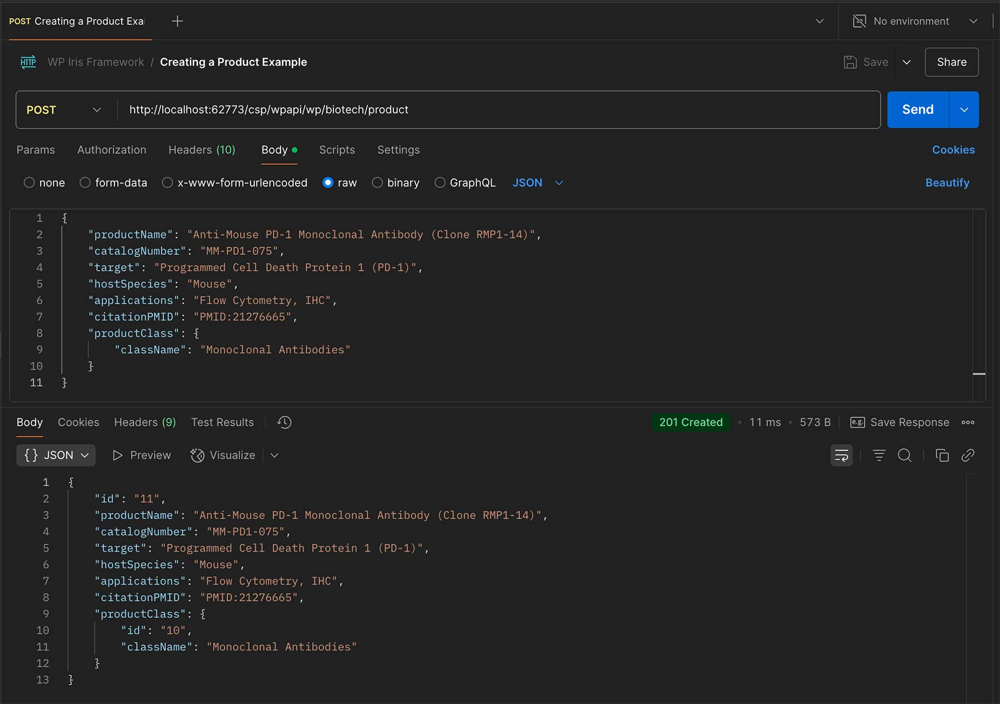

# Working with Postman to Test API



## Creating a new Product

### How to structure your request:

1. HTTP Method: POST
2. URL: i.e. http://localhost:62773/csp/wpapi/wp/biotech/product
3. Headers:
```
Content-Type: application/json
```

4. Request Body:
```
{
    "productName": "Recombinant Human IL-2 Protein",
    "catalogNumber": "RH-IL2-100",
    "target": "Interleukin-2",
    "hostSpecies": "Human",
    "applications": "Flow Cytometry, Immunocytochemistry, Immunohistochemistry, Immunoprecipitation, Western Blot",
    "citationPMID": "PMID:12345678",
    "productClass": {
        "className": "Cytokines"
    }
}
```

Note: When doing a Create in Postman or similar interface, the productName and catalogNumber are required fields. All other fields are optional
The productClass is optional and can be included if you want to associate the product with a class

## Updating a Product

### How to structure your request:

1. HTTP Method: POST
2. URL: i.e. http://localhost:62773/csp/wpapi/wp/biotech/product/{id}
   (Replace {id} with the actual product ID)
3. Headers:
```
Content-Type: application/json
```

4. Request Body:
```
{
    "productName": "Updated Product Name",
    "catalogNumber": "Updated-CAT-123",
    "target": "Updated Target",
    "hostSpecies": "Updated Species",
    "applications": "Updated Applications",
    "citationPMID": "Updated PMID",
    "productClass": {
        "className": "Updated Class Name"
    }
}
```

Note: All fields are optional - you only need to include the fields you want to update. The response will include the complete updated product object.

## Getting a Product by ID

### How to structure your request:

1. HTTP Method: GET
2. URL: i.e. http://localhost:62773/csp/wpapi/wp/biotech/product/{id}
   (Replace {id} with the actual product ID)
3. Headers:
```
Content-Type: application/json
```

Note: No request body is needed. The response will include the complete product object if found, or an empty object if not found.

## Deleting a Product

### How to structure your request:

1. HTTP Method: DELETE
2. URL: i.e. http://localhost:62773/csp/wpapi/wp/biotech/product/{id}
   (Replace {id} with the actual product ID)
3. Headers:
```
Content-Type: application/json
```

Note: No request body is needed. A successful deletion will return a 204 No Content status code.

## Response Codes

- 200 OK: Successful GET or UPDATE operation
- 201 Created: Successful POST operation
- 204 No Content: Successful DELETE operation
- 400 Bad Request: Missing required fields or invalid data format
- 404 Not Found: Resource not found (for GET, UPDATE, or DELETE operations)
- 500 Internal Server Error: Server-side error occurred

## Example Responses

### Successful Create Response (201):
```json
{
    "id": "1",
    "productName": "Recombinant Human IL-2 Protein",
    "catalogNumber": "RH-IL2-100",
    "target": "Interleukin-2",
    "hostSpecies": "Human",
    "applications": "Flow Cytometry, Immunocytochemistry, Immunohistochemistry, Immunoprecipitation, Western Blot",
    "citationPMID": "PMID:12345678",
    "productClass": {
        "id": "1",
        "className": "Cytokines"
    }
}
```

### Error Response (400):
```json
{
    "error": "Missing required fields: productName and catalogNumber are required"
}
```

### Not Found Response (404):
```json
{
    "error": "Product not found with ID: 999"
}
```